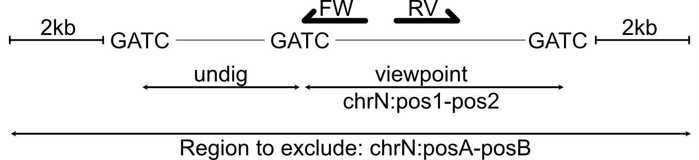
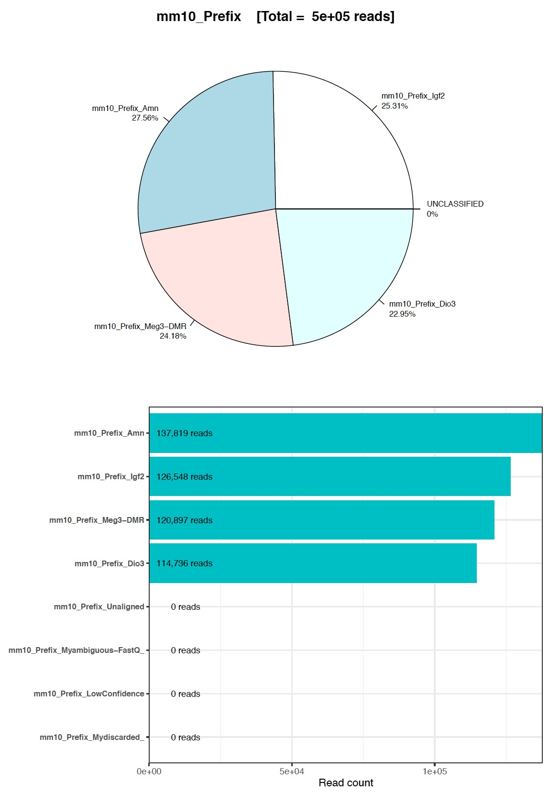
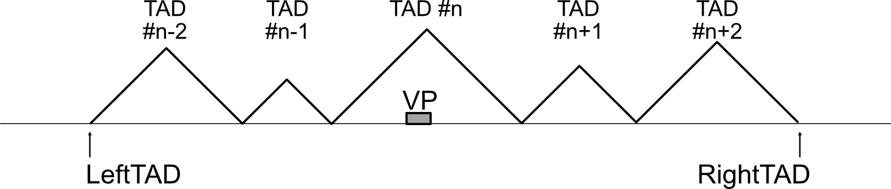

# c4ctus Readme


## 1- What is c4ctus?
**c4ctus** (Compute 4C Tracks on U'r server) consist in a series of scripts to computer 4C-seq tracks from raw fastQ reads.

**c4ctus**  mostly relies on the strategies used in HTSstation developed by the BBCF (EPFL, Lausanne, Switzerland). Documentations and existing strategy are described in [David et al. 2014](https://doi.org/10.1371/journal.pone.0085879) (including the Supplementary file 1). Most of the original scripts are available in <https://github.com/bbcf/bbcflib>, <https://github.com/bbcf/bbcfutils>. Carefull, not every functionalites of the original 4C-seq module have been implemented in **c4ctus**.

**c4ctus** has been designed to minimize the number of depencies (see below).


## 2- Dependencies

- Exonerate (version 2.2.0) <https://www.ebi.ac.uk/about/vertebrate-genomics/software/exonerate>
- Bedtools (2.26.0 or above)
- samtools (1.3.1 or above)
- Bowtie2 (2.3.0)
- Python2.7 with the following libraries (pysam, Bio.Restriction, argparse, ... )
- Perl (Getopt::Long, Pod::Usage)
- Sqlite3
- R  with the following libraries (ggplot2, stringr, RSQLite, zoo, grid, plotrix, reshape2, scales, fields, ...)
- bash (version 4 or above)


## 3- Install

Add all the bins to your PATH.

⚠️ **Before using c4ctus, update** the following lines of the listed scripts:⚠️

- c4ctus_4C-seq.sh: 
	- lines 135 and 136: Update the path to the LogCount.cnt file
	- lines 254: Update the path to a directory with chrom.sizes files
- c4ctus_Mapping.sh:
	- lines 108-119: update the path wereby needed. You can add other assemblies according to your needs. 	
- callDomainogram.sh:
	- line 31: update the path to the folder containing the R domainograms scripts (`domainogram_functions.R`, `runDomainogram.R`, `downstreamAnalysis_Rfunctions.R`), i.e. the c4ctus bin folder. 


## 4- List of tools (steps)


### a) CREATE 4C-LIB
```
  c4ctus_4CLib.sh         --fasta <GenomeFasta>
                          --genome <GenomeNickName>
                          --PrimaryEnzyme <PrimaryRestrEnzyme>
                          --SecondaryEnzyme <SecondaryRestrEnzyme>
                          --length <SegmentLength>
                         [--output <OutputFolder]
                         [--rmsk GenomeRmskTab]
                         
```

                         
### b) DEMULTIPLEXING
```
  c4ctus_Demult.sh         -f <FastQ> 
                           -p <PrimerFile> 
                           -g <GroupName>
                           [--Ncpu <Nbr cpu>]
                           [--trim <True|False>]
                           [other parameters]
```


### c) MAPPING

#### single file
```
  c4ctus_Mapping.sh        -f <FastQReadFile> -g <Genome Assembly>
                           [--maxhits <NumberOfReportedHits> (default = 5)]
```

#### multiple files
```
  c4ctus_MultiMapping.sh   -p <PrimerFile> -g <GroupName> 
                           --genome <Assembly>
                           [--Ncpu <NumTHREADS>]
                           [--maxhits <NumberOfReportedHits> (default = 5)]
```


### d) 4C-SEQ

#### single file
```
  c4ctus_4Cseq.sh          --lib4C <4CLib> --genome <Assembly>
                           -f <MapDensityFwd> -r <MapDensityRev>
                           -e <RegToExclude> -w <RollWindowSize>
                           [-n <NickName>]
```
                           
#### multiple files
```
  c4ctus_Multi4Cseq.sh     --lib4C <4CLib> --primer <PrimerFile> 
                           --group <GroupName> --genome <Assembly>
                           [--Ncpu <NumTHREADS>]
                           [--window <RollWindowSize>] 
```


### e) NORMALIZE 4C-TRACKS
```
  c4ctus_Normalize.sh      -f <SQL> --Excl <chrA:pos1-pos2>
                           --LeftTAD <Coordinate>
                           --rightTAD <Coordinate>
                           [-o <output file>]
```


### f) DOMAINOGRAMS
```
  c4ctus_Domainogram.sh    -i <SQL_file>
                           [options]
                           
(experimental)
  RePlotDomainogram.R      <domainograms.RData file> <OutputFile>
```


## 4- Design of the primer File

**c4ctus** relies on a primer file for processing RAW 4C-seq sequencing reads. The primer file is a *fasta* file containing information about each barcode (i.e. the Forward 4C primer) supposedly present at the beginning of each Illumina reads.

As any fasta file, it is composed of a description line (starting with `>`) and followed by a sequence. The sequence information is needed for demultiplexing the reads. The description line contains informations used for the demultiplexing, 4C-seq and Normalization steps.

The sequence contains the first 18 base pairs of the forward primer used for amplification (don't include Illumina adapters).

The description line is composed of the following fields separated by the pipe character `|` without space:

	1. `>`
	2. The barcode (= primer) name
	3. The sequence from the 5' end of the primer up to the primary restriction included (eg. GATC for DpnII)
	4. Coordinates of the viewpionts using the format chrN:pos1-pos2, pos1 and pos2 being the coordinates the two consecutive primary restriction sites.
	5. The sequence recognized by the primary restriction enzyme
	6. The coordinates of a region around the viewpoint that will be excluded from the analysis (score set to zeros). The format is chrN:posA-posB, posA and posB being as shown in the figure below.


| How are coordinates defined for the design of the primer file. The drawing below assumes that DpnII was used as a primary restriction enzyme (= 1st cutter). |
| --- |
|     |


## 5- Long Help (Tutorial) with test dataset

A small fastq file (only 500,000 reads, from 4 viewpoints) can be found in test_dataset/mm10 folder to test the script functionalities. The corresponding primer file `barcode.fa` can be found in the same folder.


### a) To follow this tutorial, download test_dataset, genome sequence and RMSK

Create an empty folder, then:

	#Download the test dataset and primer file
	🔴 wget https://github.com/NoordermeerLab/c4ctus/test_dataset/mm10/mm10_SmallSubset.fastq.gz
	🔴 wget wget https://github.com/NoordermeerLab/c4ctus/test_dataset/mm10/barcode.fa
	
	
	#Download Mouse mm10 fasta sequence
	wget http://hgdownload.cse.ucsc.edu/goldenpath/mm10/bigZips/mm10.fa.gz
	#uncompress
	gunzip mm10.fa.gz
	
	
	#Download RMSK file
	wget http://hgdownload.cse.ucsc.edu/goldenpath/mm10/database/rmsk.txt.gz
	#uncompress
	gunzip rmsk.txt.gz

Follow the steps below. All **c4ctus** instructions be called from the folder that you just created.


### b) Generate 4C-Lib

	c4ctus_4CLib.sh --fasta mm10.fa \
                   --genome mm10 \
                   --PrimaryEnzyme DpnII \
                   --SecondaryEnzyme NlaIII \
                   --length 30 
                   --rmsk rmsk.txt

This generates a `4CLib` folder containing:

- `Library_mm10_DpnII_NlaIII_30bps_Rmsk_segmentsInfos.bed` file = the 4C-Library with information on the RepeatMasker information included
- `Library_mm10_DpnII_NlaIII_30bps_segmentsInfos.bed`file = the 4C-Library without any information regarding the Repeats
- a `debug` folder for debugging purpose (its content can essentially be deleted)


### c) Demultiplexing Reads

	c4ctus_Demult.sh --fastq mm10_SmallSubset.fastq.gz \
                    --primer barcode.fa \
                    --group mm10_Prefix
          

This outputs:

- 4 demultiplexed fastq.gz files
- a FileList text foile
- a PDF demultiplexing report
- a debug folder containing informations for debugging, which you can most probably delete.


| The demultiplexing report. For this example, no reads are UNCLASSIFIED. In a real experiment, UNCLASSIFIED reads accounts for 1-15% of the reads (depending on if some PhiX was added before sequencing)|
| --- |
|   |


### d) Mapping the reads

There are two ways to map the reads: 

- option 1: Either the reads coming from each viewpoint are mapped one viewpoint at a time. This requires one instruction per viewpoint.
- option 2: Either the reads coming from **all** the viewpoints are mapped in a single instruction. Each mapping is single threaded. Up to `<Ncpu>` viewpoints are mapped simultaneously.


#### option 1

	c4ctus_Mapping.sh --fastq Demultiplexing/mm10_Prefix_Amn.fastq.gz
	                  --genome mm10
	                  [--maxhits 5]
	                  
	c4ctus_Mapping.sh --fastq Demultiplexing/mm10_Prefix_Igf2.fastq.gz
	                  --genome mm10
	                  [--maxhits 5]         

	c4ctus_Mapping.sh --fastq Demultiplexing/mm10_Prefix_Dio3.fastq.gz
	                  --genome mm10
	                  [--maxhits 5]  
	                  
	c4ctus_Mapping.sh --fastq Demultiplexing/mm10_Prefix_Meg3-DMR.fastq.gz
	                  --genome mm10
	                  [--maxhits 5]  

	                  
#### option 2

	c4ctus_MultiMapping.sh --primer barcode.fa
	                       --group mm10_Prefix
	                       --genome mm10
	                       [--Ncpu 4]
	                       [--maxhits 5]

This will map the all the fastq.gz named as follows: `Demultiplexing/mm10_Prefix_<Viewpoint>.fastq.gz`. Note that `mm10_Prefix` is the argument given as a file prefix in the demultiplexing step.


This generates a Mapping folder containing

- the `.bam` and `.bai` files for each viewpoint
- Two density files (fwd and rev) for each viewpoints (use in the following 4C-seq step)
- a log file (if using option 2)
- a debug folder containing informations for debugging, which you can most probably delete.


### e) 4C-seq module

As for the mapping step, there are two ways to compute 4C-seq scores using the mapping densities: 

- option 1: Either the fwd and rev density comming from each viewpoint are processed together, but **one viewpoint at a time**. This requires one instruction per viewpoint.
- option 2: Either the fwd and rev density comming from each viewpoint are processed together and for **all** the viewpoint.


#### option 1
	
	#For Amn
	c4ctus_4Cseq.sh --lib4C 4CLib/Library_mm10_DpnII_NlaIII_30bps_Rmsk_segmentsInfos.bed 
	                --genome mm10
	                --densF Mapping/mm10_Prefix_Amn_mm10_Density_fwd.txt
	                --densR Mapping/mm10_Prefix_Amn_mm10_Density_rev.txt
	                --Excl chr12:111269231-111274623
	                --window 11

	#Same for the other viewpoint. 
	#Don't forget to adapt the Coordinates of the region to exclude for each viewpoint
	
	
#### option 2
	
	c4ctus_Multi4Cseq.sh 4CLib/Library_mm10_DpnII_NlaIII_30bps_Rmsk_segmentsInfos.bed
	                     barcode.fa
	                     mm10_Prefix
	                     mm10
	                     4


This generates a 4Cseq folder containing for each `<Viewpoint>`:

- `segToFrag_mm10_Prefix_<Viewpoint>_mm10_rep<Number>_all.bedgraph` file: a bedgraph file of all valid restriction 1st-cutter - 1st cutter fragments with the 4C-seq scores
- `segToFrag_mm10_Prefix_<Viewpoint>_mm10_rep<Number>_NonZeros.bedgraph` file: same than `_all.bedgraph` file, but restriction fragments with score == 0 are removed.
- `segToFrag_mm10_Prefix_<Viewpoint>_mm10_rep<Number>_all.sql` file: same than `_all.bedgraph` but informations are encapsulated into a `.sql` file. One table per chromosome.
- `mm10_Prefix_<Viewpoint>_mm10_rep<Number>_<CHR>_smoothed_11FragPerWin.bedgraph` file: smoothed bedgraph of the viewpoint containing chromosome (rolling mean over 11 restriction fragment by default).
- Log files
- a debug folder containing informations for debugging, which you can most probably delete.


### f) Normalization of 4C-seq bedgraphs

	c4ctus_Normalize.sh --sqlFile segToFrag_mm10_Prefix_Amn_mm10_rep<Number>_all.sql
	                    --Excl chr12:111269231-111274623
	                    --window 11
	                    --LeftTAD 105970000
	                    --RightTAD 110860000
	                    
This generates a file ending with `_<CHR>_smoothed_11FragPerWin_Norm.bedgraph` which correspond to normalized 4C-seq scores that can be compared between samples. This normalization multiplies the 4C-seq scores by an appropriate scaling factor so that  the sum of RAW 4C score in the interval `LeftTAD` - `RightTAD` equals 1 million.

For mammals, we usually define `LeftTAD` and `RightTAD` as the coordinates of the two upstream and two downstream TADs of the viewpoint-containing TAD plus 5 restriction sites upstream and downstream. This is illustrated in the Figure below:

| Definition of the coordinates for 4C-seq scores normalization|
|---|
| |


### g) Computation of Domainograms
To do...


